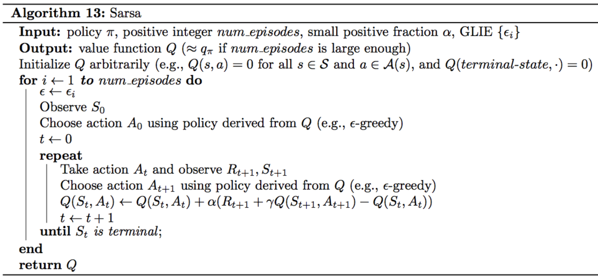
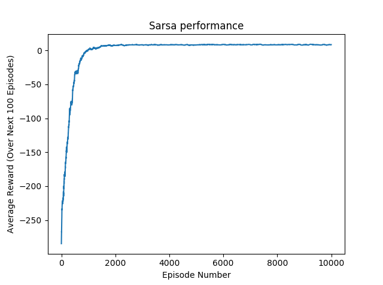
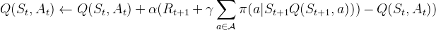
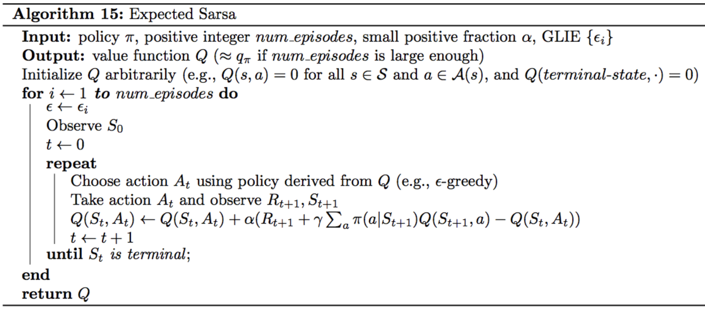
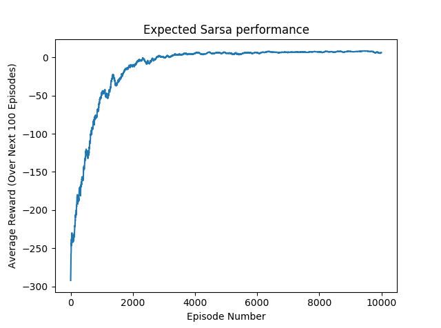
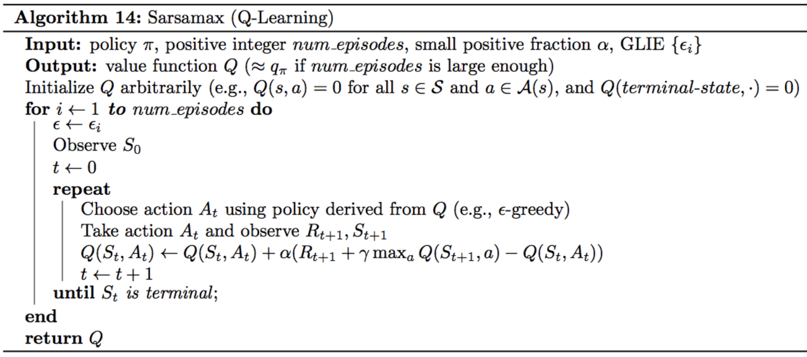
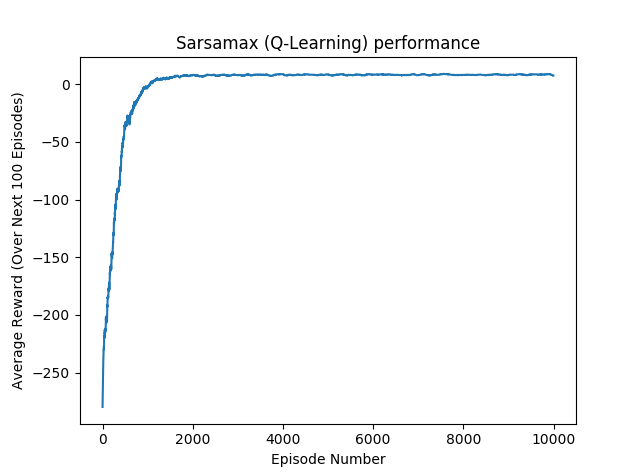

# Project: OpenAI Gym's Taxi-v2 Task

For this project, we use OpenAI Gym Taxi-v2 environment to design an 
algorithm to teach a taxi agent to navigate a small gridworld.

	

## Problem Statement
This problem comes from the paper <b>Hierarchical Reinforcement 
Learning with the MAXQ Value Function Decomposition</b> by Tom Dietterich (link
to the paper: https://arxiv.org/pdf/cs/9905014.pdf), section <b>3.1 A Motivation Example</b>.

 There are four specially-designated locations in
this world, marked as R(ed), B(lue), G(reen), and Y(ellow). The taxi problem is episodic. In
each episode, the taxi starts in a randomly-chosen square. There is a passenger at one of the
four locations (chosen randomly), and that passenger wishes to be transported to one of the four
locations (also chosen randomly). The taxi must go to the passenger’s location (the “source”), pick
up the passenger, go to the destination location (the “destination”), and put down the passenger
there. (To keep things uniform, the taxi must pick up and drop off the passenger even if he/she
is already located at the destination!) The episode ends when the passenger is deposited at the
destination location.

There are six primitive actions in this domain: (a) four navigation actions that move the taxi
one square North, South, East, or West, (b) a Pickup action, and (c) a Putdown action. Each action
is deterministic. There is a reward of −1 for each action and an additional reward of +20 for
successfully delivering the passenger. There is a reward of −10 if the taxi attempts to execute the
Putdown or Pickup actions illegally. If a navigation action would cause the taxi to hit a wall, the
action is a no-op, and there is only the usual reward of −1.
	
We seek a policy that maximizes the total reward per episode. There are 500 possible states:
25 squares, 5 locations for the passenger (counting the four starting locations and the taxi), and 4
destinations.

## Files
- `agent.py`: Agent class in which we will develop our reinforcement learning methods
- `monitor.py`: The `interace` function tests how well the agent learns from interaction with the environment
- `main.py` : Main file to run the project for checking the performance of the agent 

## Temporal-Difference (TD) Control Methods
While **Monte-Carlo** approaches requires we run the agent for the whole episode before making any decisions,
this solution is no longer viable with **continuous** tasks that does not have any terminal state, as well as **episodic** tasks for cases when we 
do not want to wait for the terminal state before making any decisions in the environment's episode.

This is where Temporal-Difference (TD) Control Methods step in, they update estimates based in part 
on other learned estimates, without waiting for the final outcome. As such, TD methods will update the 
**Q-table** after every time steps.  

### Sarsa
The Sarsa update rule is the following:

	

Notice that the action-value update uses the **S**tate, **A**ction, **R**eward, next **S**tate, next **R**eward hence the name
of the algorithm **Sarsa(0)** or simply **Sarsa**. 

	

Here is the performance of Sarsa on the Taxi task :

	

The average reward over the last 100 episodes keeps improving until the 2000th episodes, where it finally 
reaches convergence and stops improving

### Expected Sarsa
The Expected Sarsa update rule is the following:

	

Expected Sarsa uses the expected value of the next state-action pair, where the expectation takes into accoun the probability that the agent selects each possible action from the next state.

	

Here is the performance of Expected Sarsa on the Taxi task : 

	

The resulting graph is noisier than Sarsa, due to the fact we are averaging over all the possible 
actions in the next state. Convergence takes more time and there are gradually some, albeit small, improvement.

### Sarsamax (or Q-Learning)
The Sarsamax (or Q-Learning) update rule is the following:

	

In Sarsamax, the update rule attempts to approximate the optimal value function
at every time step.

	

Here is the performance of Sarsamax on the Taxi task: 

	

Sarsamax is smoother and follows the same trend as Sarsa. 

### Overview
Sarsa, Expected Sarsa and Sarsamax have been trained for 20000 episodes, and we can visualize
in the same graph their performance :

	

